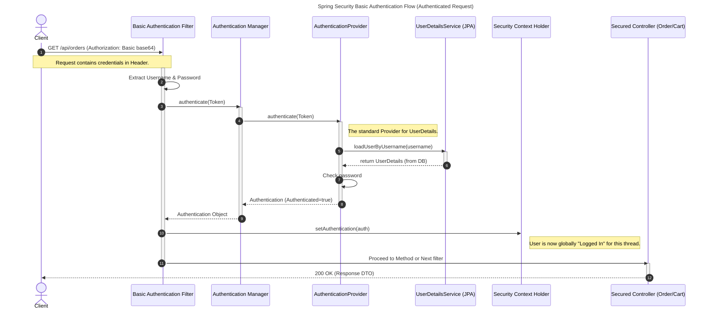
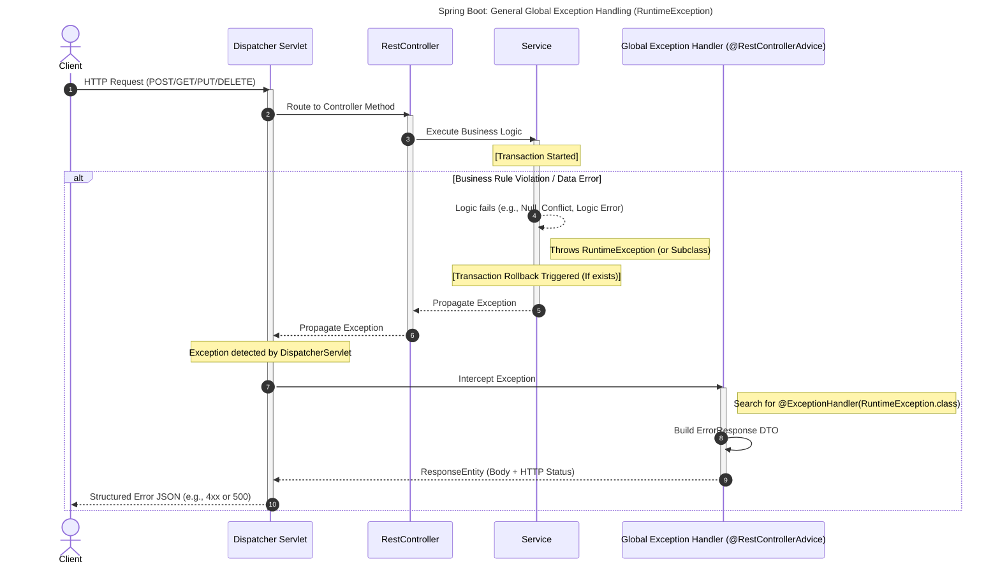
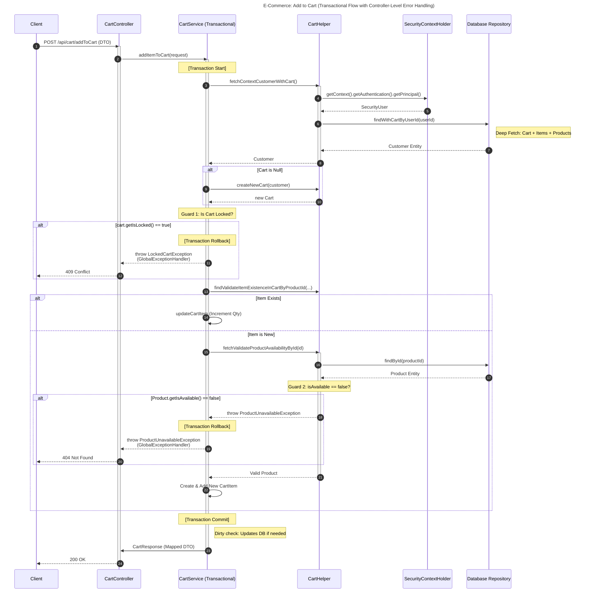
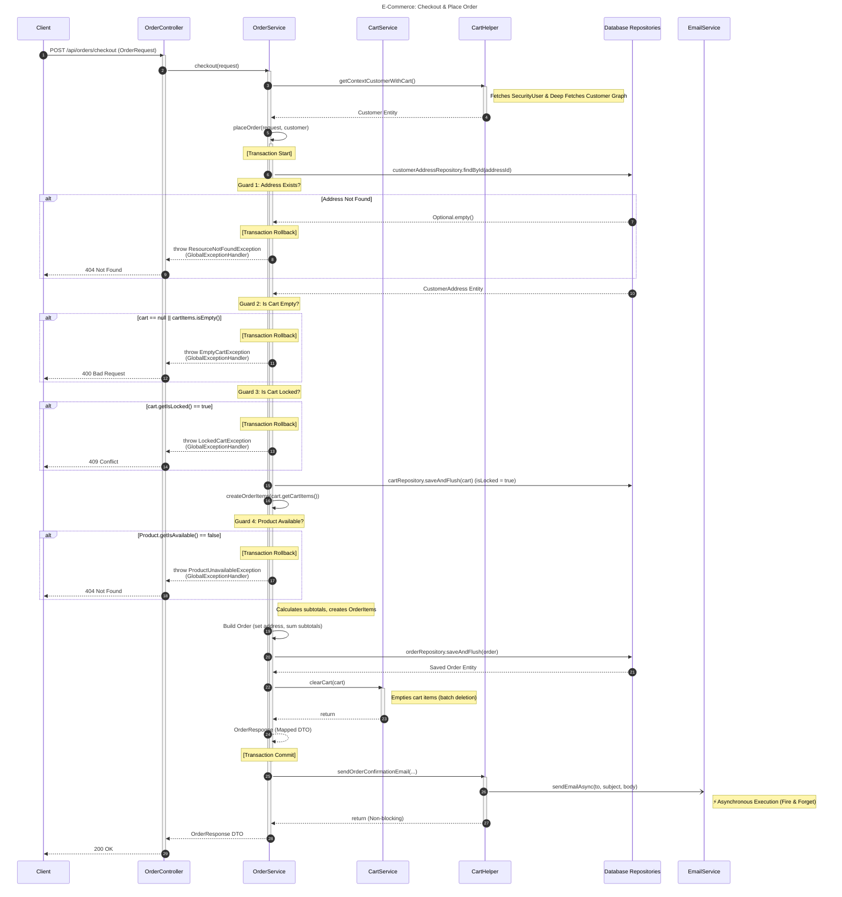

# E-Commerce Simple Showcase

This is a **E-Commerce Backend Platform** intended to demonstrate a clean, layered backend architecture. While the initial setup is straightforward, the system is built with a **Scalable First** mindset, allowing for easy adding new features.

### Key Scalability Features:

- **Containerized Environment:** Fully Dockerized for consistent deployment across any infrastructure.
- **Database Isolation:** Decoupled PostgreSQL instance with persistent volume mapping.
- **Environment-Driven:** All configurations are managed via `.env` for security and flexibility.

---

## Technology Stack

### Current Implementation:

- **Runtime:** Java 17
- **Framework:** Spring Boot 3+
- **Web:** Spring Web (RESTful API)
- **Security**: Spring Security (Securing the application with basic authentication)
- **Data:** Spring Data JPA (Hibernate)
- **Database:** PostgreSQL 
- **DevOps:** Docker & Docker Compose
- **Build Tool:** Maven

### Planned Roadmap (Future Enhancements):

- **Security:** Integration of **Spring Security** with JWT for stateless authentication (DONE).
- **Migrations:** **Liquibase** for version-controlled database schema management.
- **Messaging:** **Spring SMTP** for automated order confirmation and registration emails (DONE).
- **Caching:** Redis integration for product catalog performance.

---
## Docker Deployment
### First Time
```shell
./scripts/buildContainer.sh
```
### Image created
```shell
docker compose up
```

## Documentation
### Browsing endpoints
- After running containers deployment
- go to your browser 
> http://localhost:8080/swagger-ui/index.html
### Features
- Category Management.
- Product Management.
- Customer registration.
- Customer Login
- Securing Endpoints with JWT Access Tokens.
- Using ***HATEOS*** for linking relative endpoints.
- Sending emails with ***Spring SMTP***.
- Sending Welcome mail after new customer registration.
- Cart Management.
- Checkout (Place Order).
- Sending Welcome Email after customer registration.
- Sending confirmation email after order checkout.
- User can login and ***JWT Access Token***.
- OpenAPI Documentation.
### Exceptions

- Using ***GlobalExceptionHandler*** for centralized exception handling 
- Creating initial exceptions for ***Clear and Documented*** API responses

### Entities
- Initial required entities for the project
- Fetching data lazily to avoid fetching unnecessary data
- Using ***@NameEntityGraph*** to efficiently fetch data from the Database.

### Repositories
- Initial ***JPA*** repository.
- Using ***JpaRepository*** for ***Paging and Sorting & other JPA features***.

### Services
- Using the naming convention IServiceName to separate the service from it's implementation
  better than using ServiceNameImp Convention making the code cleaner and robust.

### Controllers
#### Assemblers
- Using ***Spring HATEOS*** to add links to relevant operations.
---
### Diagrams
#### Basic Auth flow

#### Global Exception handler


#### Add To Cart flow

#### Checkout & Place Order flow

## Contact & Contribution

- **Author:** Abdalla Samir Khalifa
- **Role:** Systems Analyst & Backend Developer
- **Contact**:
  - GitHub: [@AbdallaSamirKhalifa](https://github.com/AbdallaSamirKhalifa)
  - Email: [abdallasamirkhalifa@gmail.com](abdallasamirkhalifa@gmail.com)
  - Linkedin: [Abdalla Khalifa](https://linkedin.com/in/abdalla-khalifa)
